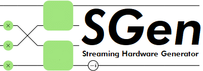
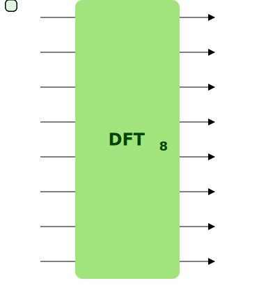
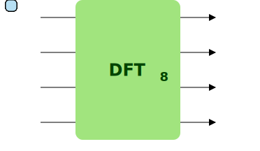

SGen is a generator capable of producing efficient hardware designs for a variety of signal processing transforms. These designs operate on *streaming* data, meaning that the dataset is divided into several chunks that are processed during several cycles, thus allowing a reduced use of resources. The size of these chunks is called the *streaming width*. As an example, the figures below represent three discrete Fourier transforms on 8 elements, with a streaming width of 8 (no streaming), 4 and 2.

<div style="display: flex;justify-content: center;">



</div>

The generator outputs a Verilog file that can be used for FPGAs.

An overview of the architecture of this generator is available [here](https://acl.inf.ethz.ch/research/hardware), along with an interface to download various generated designs.

## Quick Start
The easiest way to use SGen is by using [SBT](https://www.scala-sbt.org/):

```
git clone https://github.com/fserre/sgen.git
cd sgen
sbt "run -n 3 wht"
```

This generates a streaming Walsh-Hadamard transform on 8 points.

## Command-line interface
A command line consists of a list parameters followed by the desired transform. 

### Parameters
The following parameters can be used:
* `-n `*`n`* Logarithm of the size of the transform. As an example, `-n 3` means that the transform operates on 2^3=8 points. This parameter is required.
* `-k `*`k`* Logarithm of the *streaming width* of the implementation. `-k 2` means that the resulting implementation will have 2^2=4 input ports and 4 output ports, and will perform a transform every 2^(*n*-*k*) cycles. In case where this parameter is not specified, the implementation is not *folded*, i.e. the implementation will have one input port and one output port for each data point, and will perform one transform per cycle.  
* `-r `*`r`* Logarithm of the radix (for DFTs and WHTs). This parameter specifies the size of the base transform used in the algorithm. *r* must divide *n*, and, for compact designs (`dftcompact` and `whtcompact`), be smaller or equal to *k*. It is ignored by tranforms not requiring it (permutations). If this parameter is not specified, the highest possible radix is used.
* `-o `*`filename`* Name of the output file.
* `-benchmark` Adds a benchmark module in the generated design.
* `-rtlgraph` Produces a [DOT](https://en.wikipedia.org/wiki/DOT_(graph_description_language)) graph representing the design.
* `-dualramcontrol` Uses dual-control for memory (read and write addresses are computed independently). This option yields designs that use more resources than with single RAM control (default), but that have more flexible timing constraints (see the description in generated files). This option is automatically enabled for compact designs.
* `-singleported` Uses single-ported memory (read and write addresses are the same). This option has the same constraints as single RAM control (default), but may have a higher latency.
* `-zip` Creates a zip file containing the design and its dependencies (e.g. FloPoCo modules). 
* `-hw `*`repr`* Hardware arithmetic representation of the input data. *`repr`* can be one of the following:
  * `char` Signed integer of 8 bits. Equivalent of `signed 8`.
  * `short` Signed integer of 16 bits. Equivalent of `signed 16`.
  * `int` Signed integer of 32 bits. Equivalent of `signed 32`.
  * `long` Signed integer of 64 bits. Equivalent of `signed 64`.
  * `uchar` Unsigned integer of 8 bits. Equivalent of `unsigned 8`.
  * `ushort` Unsigned integer of 16 bits. Equivalent of `unsigned 16`.
  * `uint` Unsigned integer of 32 bits. Equivalent of `unsigned 32`.
  * `ulong` Unsigned integer of 64 bits. Equivalent of `unsigned 64`.
  * `float` Simple precision floating point (32 bits). Equivalent of `ieee754 8 23`.
  * `double` Double precision floating point (64 bits). Equivalent of `ieee754 11 52`.
  * `half` Half precision floating point (16 bits). Equivalent of `ieee754 5 10`.
  * `minifloat` Minifloat of 8 bits. Equivalent of `ieee754 4 3`.
  * `bfloat16` bfloat16 floating point . Equivalent of `ieee754 8 7`.
  * `unsigned `*`size`* Unsigned integer of *size* bits.
  * `signed `*`size`* Signed integer of *size* bits. Equivalent of `fixedpoint `*`size`*` 0`.
  * `fixedpoint `*`integer fractional`* Signed fixed-point representation with a integer part of *integer* bits and a fractional part of *fractional* bits.
  * `flopoco `*`wE wF`* [FloPoCo](http://flopoco.gforge.inria.fr/) floating point representation with an exponent size of *wE* bits, and a mantissa of *wF* bits. The resulting design will depend on the corresponding FloPoCo generated arithmetic operators, which must be placed in the `flopoco` folder. In the case where the corresponding vhdl file is not present, SGen provides the command line to generate it. Custom options (e.g. `frequency` or `target`) can be used.
  * `ieee754 `*`wE wF`* IEEE754 floating point representation with an exponent size of *wE* bits, and a mantissa of *wF* bits. Arithmetic operations are performed using [FloPoCo](http://flopoco.gforge.inria.fr/). Note that, unless otherwise specified when generating FloPoCo operators, denormal numbers are flushed to zero.
  * `complex `*`repr`* Cartesian complex number. Represented by the concatenation of its coordinates, each represented using *repr* arithmetic representation.
  
### Transforms
Supported transforms are the following:
#### Streaming linear permutations
[Linear permutations](https://acl.inf.ethz.ch/research/hardware/perms/) can be implemented using the `lp` command:
```
# generates a bit-reversal permutation on 32 points, streamed on 2^2=4 ports.
sbt "run -n 5 -k 2 lp bitrev"

# generates a streaming datapath that performs a bit-reversal permutation on 8 points on the first dataset, and a "half-reversal" on the second dataset on 2 ports
sbt "run -n 3 -k 1 lp bitrev 100110111"
```
The command `lp` takes as parameter the invertible bit-matrix representing the linear permutation (see [this publication](https://fserre.github.io/publications/pdfs/fpga2016.pdf) for details) in row-major order. Alternatively, the matrix can be replaced by the keyword `bitrev` or `identity`.

Several bit-matrices can be listed (seperated by a space) to generate a datapath performing several permutations. In this case, the first permutation will be applied to the first dataset entering, the second one on the second dataset, ...

The resulting implementation supports *full throughput*, meaning that no delay is required between two datasets.

#### Fourier Transforms (full throughput)
Fourier transforms (with full-throughput, i.e. without delay between datasets) can be generated using the `dft` command:
```
# generates a Fourier transform on 16 points, streamed on 4 ports, with fixed-point complex datatype with a mantissa of 8 bits and an exponent of 8 bits.
sbt "run -n 4 -k 2 -hw complex fixedpoint 8 8 dft"
```

#### Fourier Transforms (compact design)
Fourier transforms (with an architecture that reuses several times the same hardware) can be generated using the `dftcompact` command:
```
# generates a Fourier transform on 1024 points, streamed on 8 ports, with fixed-point complex datatype with a mantissa of 8 bits and an exponent of 8 bits.
sbt "run -n 10 -k 3 -hw complex fixedpoint 8 8 dftcompact"
```

### RAM control
In the case of a streaming design (n > k), memory modules may need to be used. In this case, SGen allows to choose the control strategy used for this module:
* Dual RAM control: read and write addresses are computed independently. This offers the highest flexibility (a dataset can be input at any time after the previous one), but this uses more resources. It is automatically used for compact designs (`dftcompact`), but can be enabled for other designs using the `-dualRAMcontrol` parameter.
* Single RAM control: write address is the same as the read address, delayed by a constant time. This uses less resources, but it has less flexibility: a dataset must be input either immediately after the previous one, or wait that the previous dataset is completely out. This is the default mode (except for compact designs).
* Single-ported RAM: write and read addresses are the same. This has the same constraints as Single RAM control, but may have a higher latency.
